# Procesverslag
Markdown is een simpele manier om HTML te schrijven.  
Markdown cheat cheet: [Hulp bij het schrijven van Markdown](https://github.com/adam-p/markdown-here/wiki/Markdown-Cheatsheet).

Nb. De standaardstructuur en de spartaanse opmaak van de README.md zijn helemaal prima. Het gaat om de inhoud van je procesverslag. Besteedt de tijd voor pracht en praal aan je website.

Nb. Door *open* toe te voegen aan een *details* element kun je deze standaard open zetten. Fijn om dat steeds voor de relevante stuk(ken) te doen.

## Jij

  
uitwerken voor kick-off werkgroep

  ### Auteur:
  Tyneisha van Veltum

  #### Je startniveau:
  Blauw

  #### Je focus:
  Responsive
 

## Je website

  
uitwerken voor kick-off werkgroep

  ### Je opdracht:
  https://milkbarstore.com

  #### Screenshot(s) van de eerste pagina (small screen): 
  Milk Bar homepagina
  

  #### Screenshot(s) van de tweede pagina (small screen):
  Milk Bar product-pagina van Birthday Cake
  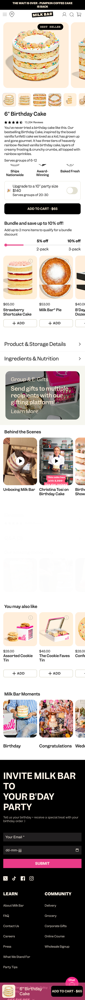
 

## Toegankelijkheidstest 1/2 (week 1)

  
uitwerken na test in 2e werkgroep

  ### Bevindingen
    #### Bevindingen eerste toegankelijkheidstoets (09/09/25)
    ##### Content 

    Milk Bar maakt gebruik van simpele taal, maar zij maken wel veel gebruik van trendy termen. Zo proberen zij internet afkortingen te gebruiken zoals 'fam', in plaats van 'family', maar ook zinnen zoals: "cozy weatcher calls for cozy treats." Ze maken dan ook veel gebruik van metaforen die wellicht lastig kunnen zijn voor mensen die zich niet bewust zijn van internet-taal. 

    De buttons en links op de homepagina hebben soms beperkte informatie. Zo hebben ze een aantal "learn-more"-buttons en "order-now"-buttons. Zo heb ik deze twee vereisten een nee gegeven voor de eerste toegankelijkheidstoets. 

    ##### Global code 
    De HTML code is niet gevalideerd. De rode errors zijn onder andere van:

    - ID's die worden gedupliceerd in de code
    - Img's die geen alt-tekst hebben
    - CSS die geschreven is in de HTML

    Ook is er een "polite"-message wanneer de voice over wordt geactiveerd op de website. De website geeft dan aan dat als er feedback is voor de website, dat dit kan worden verstuurd naar het bedrijf. 
    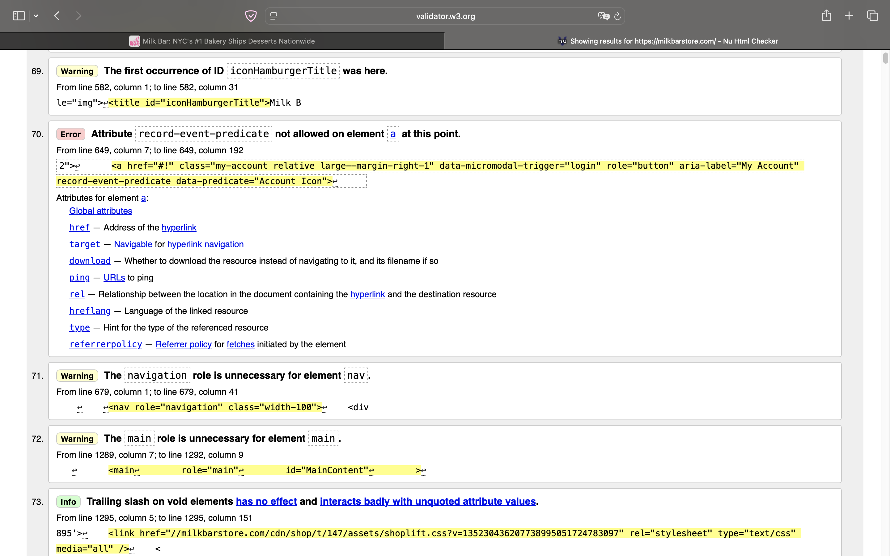
    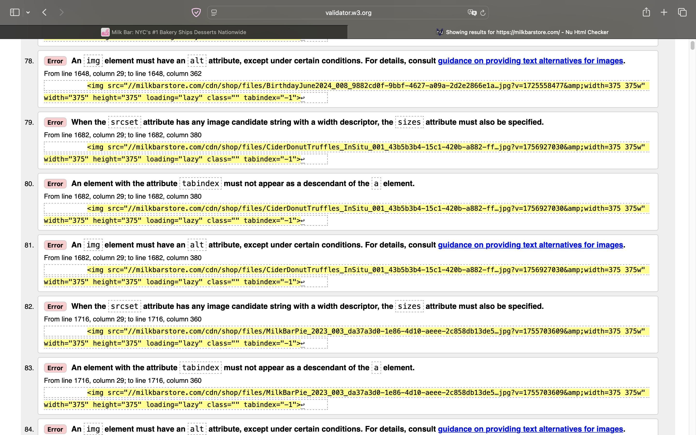
    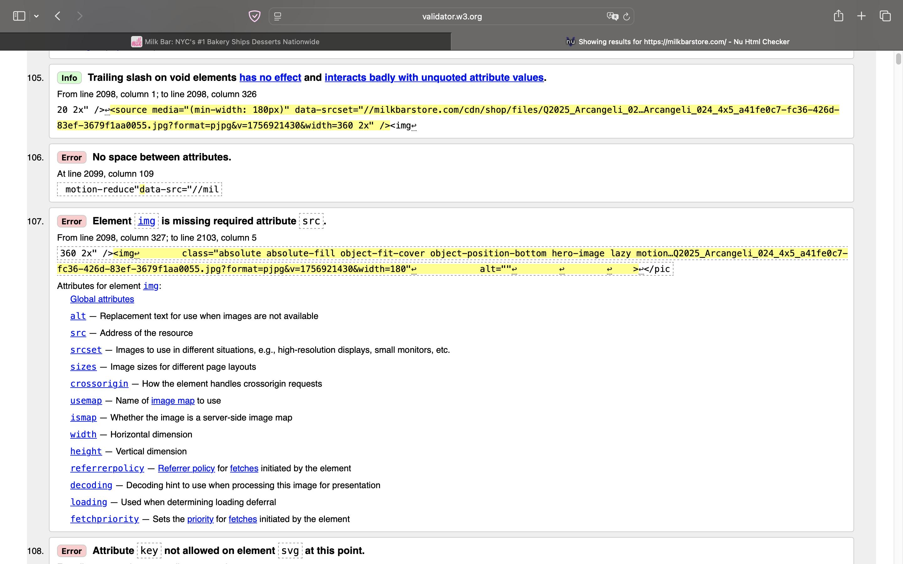

    Elke webpagina krijgt een unieke titel.
    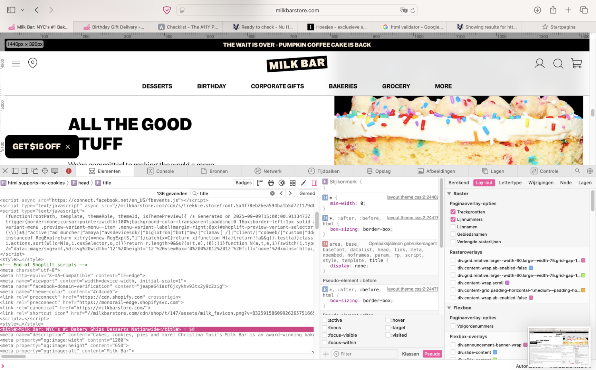

    Lang attribute wordt in de HTML geplaatst om de taal van de pagina aan te duiden. Verder is de viewport zoom niet uitgezet.
    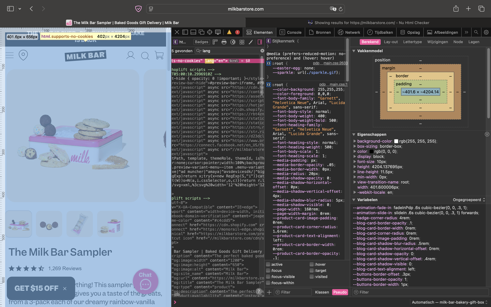

    ##### Keyboard
    Er is een duidelijke visuele focus stijl voor interactieve elementen en er kan makkelijk worden genavigeerd door middel van de toetsenbord input. 

    Echter missen er wel nog een aantal visuele elementen op de webpagina om volledig toegankelijk te zijn:

    - Zo zijn er wel pijltjes zichtbaar bij de desktopversie van de carousels, maar niet op de mobiele versie. Dan verdwijnen de pijltjes en kan er alleen nog worden gescrold van links naar rechts. 
    - Na een H2 wordt er ook weer een H1 gebruikt.

    ##### Mobile and touch

    - De website kan op elke manier worden geroteerd;
    - Horizontale scrolling is nog steeds aanwezig op de mobiele versie en de visuele pijltjes (die wel aanwezig waren bij de desktop versie) zijn verwijderd;
    - De buttons en links zijn groot genoeg om geactiveerd te worden;
    - Er is niet genoeg ruimte tussen interactieve items en een scroll-gebied:
        - Afbeeldingen zijn namelijk ook klikbaar. Dit kan zorgen voor frustratie bij handtrillingen.
    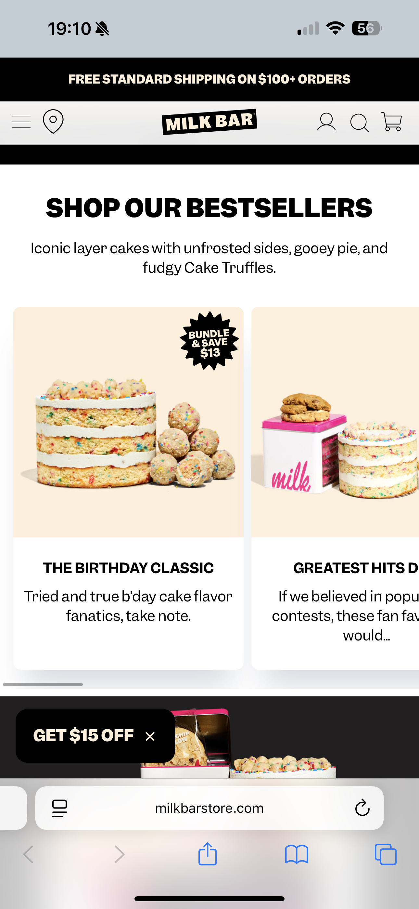

    ##### Headings
    Er wordt op de webpagina's gebruik gemaakt van heading elementen om nieuwe content te introduceren. De indeling is soms wel verschillend. Zo kan er als eerste een afbeelding worden geplaatst en daarna de heading. 

    - Er is op de homepagina gebruik gemaakt van meer dan 1 H1
    - Er worden dus ook meerdere heading levels gebruikt. De H2's en H3's worden op de juiste manier geïmplementeerd, maar er is wel meerdere keren gebruik gemaakt van de H1 op de homepagina. Dit zorgt ervoor dat de hiërarchie niet meer klopt.
    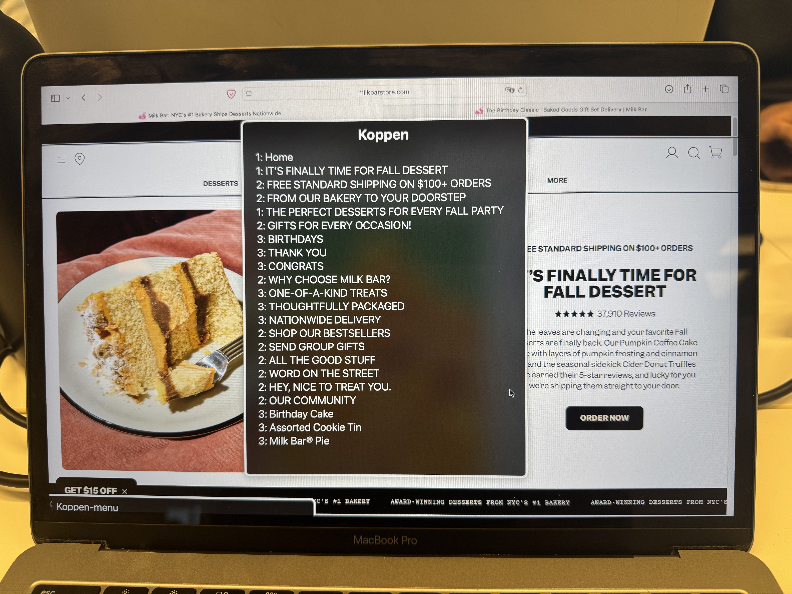

    ##### Lists
    Voor list content wordt er gebruik gemaakt van divs. Voor de verschillende carrousel secties wordt er geen gebruik gemaakt van een ul selector, maar een div.
    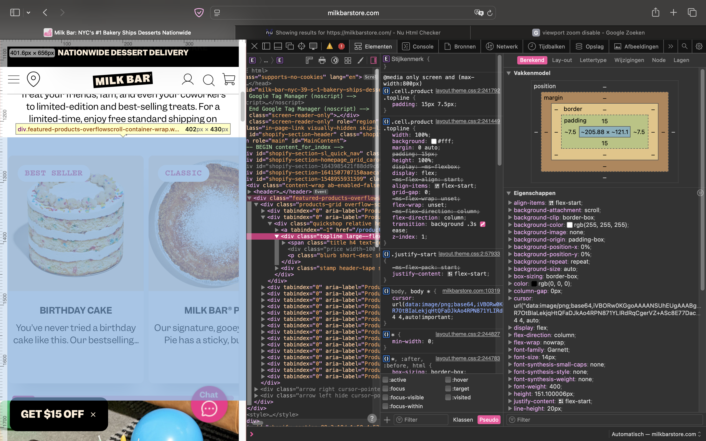  

    ##### Images
    - De HTML Validator had al aangegeven dat er voor een een grote hoeveelheid img's geen alt-tekst is gemaakt. Ik had wel een aria-label gezien bij de hero-grid. Hier werd aangegeven dat er werd doorgelinkt naar de Collection-webpagina van de website.
    - Er wordt op de website geen gebruik gemaakt van complexe afbeeldingen, zoals grafieken of kaarten.

    ##### Media (Video and Audio)
    Aan het einde van de homepagina worden drie elementen in een section getoond die de community (social media) weergeven van Milk Bar. Er is ook een TikTok die automatisch afspeelt. Er is geen audio. De video kan niet worden gepauzeerd. In de video kan er geen audio worden aangezet en is er wel ondertiteling in de video aanwezig. Dit zou niet kunnen worden afgelezen door een voice over.

    ##### Controls
    De betekenis van de selectors:

    - <a> = navigeren naar een andere pagina, sectie, bestand of extern adres.
    - <button> = een actie uitvoeren binnen de huidige pagina.
    - <link> = metadata en externe bronnen koppelen (meestal in `<head>`).

    - Een <a> wordt gebruikt voor het navigeren naar een andere pagina binnen de website.
    - Het is visueel duidelijk dat een element een link is: de woorden in de <a> zijn kapitaal, dikgedrukt en het omvat zich in een kader in een andere kleur. Er is ook een hover aanwezig (dan wordt de <a> roze). 
    - Er wordt gebruik gemaakt van de :focus states, dit is 13 keer terug te vinden in de CSS van Milk Bar.
    - Er wordt geen gebruik gemaakt van een "skip link".
    - Aan het eind van de pagina wordt er gebruik gemaakt van social media posts, bij het drukken van deze elementen wordt een nieuwe tab geopend naar het social media profiel.
    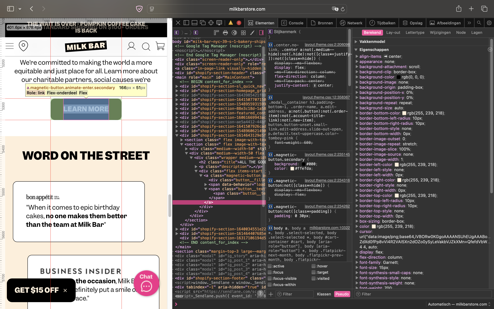

     ##### Appearance
     - Er is geen gebruik gemaakt een dark mode.
      - Bij het klassiek omkeren van de kleuren zijn de teksten en de afbeeldingen nog goed te lezen en scannen.
      - Bij het aanzetten van verschillende kleurfilters, zijn de teksten en afbeeldingen nog goed te lezen en scannen. Ik heb de volgende kleurfilters uitgeprobeerd:
        - Grijstinten
        - Protanopie (rood-groenfilter)
        - Deuteranopie (groen-roodfilter)
        - Tritanopie (blauw-geelfilter)
        - Kleurtint
      - Er is een hoog contrast, bij gebruik van de Chrome extensie Accessible Web, heeft de homepagina een score gekregen van 87 van de 100. De punten die werden getoond waren de volgende:    
      - Het is mogelijk om de website teksten te vergroten naar 200%.

    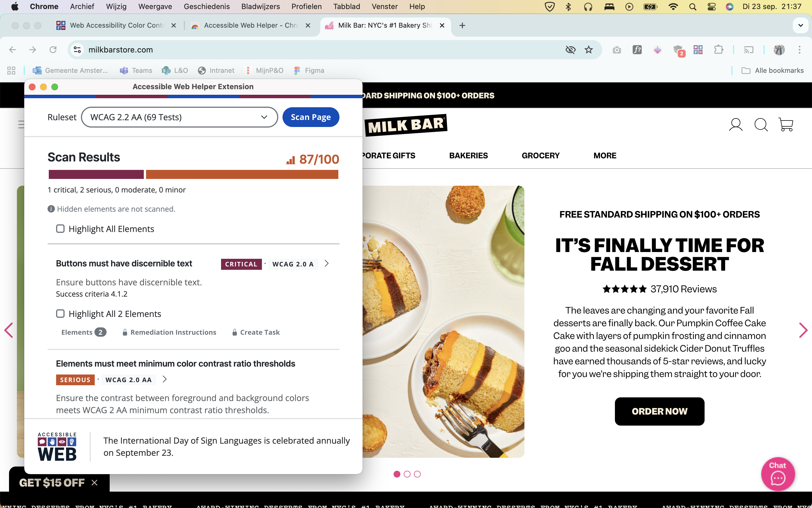
    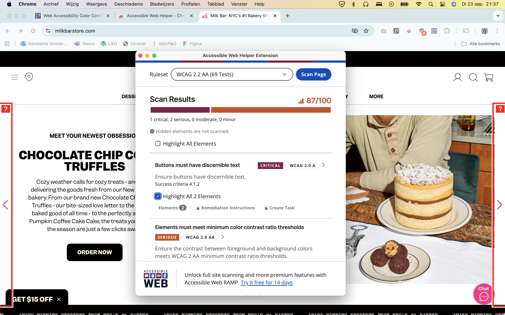
    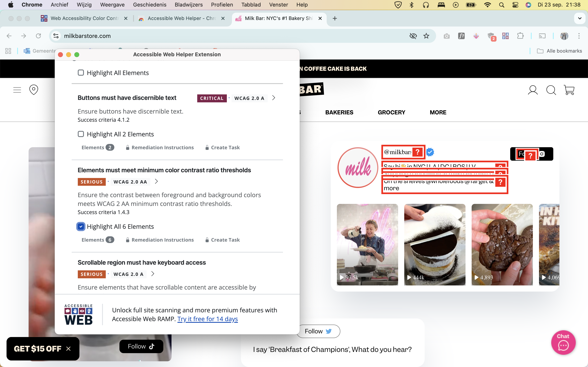
    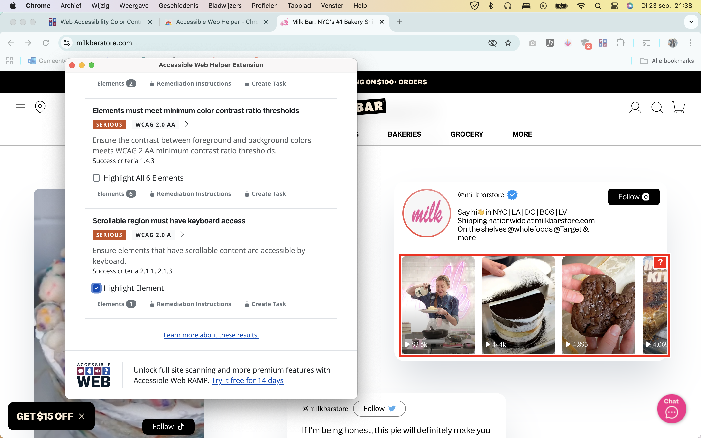
    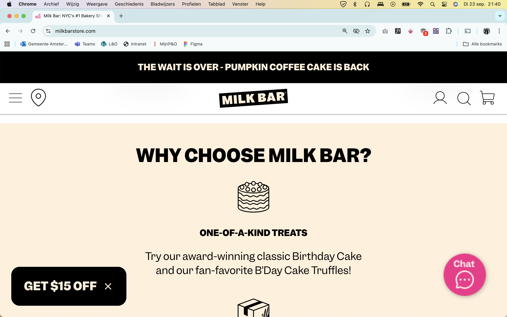

     ##### Animation
     - De animaties op de website zijn subtiel en niet te heftig.
     - Er is geen backgound video aanwezig op de website.

     ##### Color contrast
     - Contrast tussen normal-sized text is hoog;
     - Contract voor large-sized test is hoog;
     - Contrast voor iconen is hoog;
     - Contrast van teksten boven afbeeldingen is hoog;
     - Er wordt geen gebruik gemaakt van ::selection.

## Breakdownschets (week 1)

  
uitwerken na afloop 3e werkgroep

  ### de hele pagina: 
  

  ### dynamisch deel (bijv menu): 
  

  ### wellicht nog een dynamisch deel (bijv filter): 
  

## Voortgang 1 (week 2)

  
uitwerken voor 1e voortgang

  ### Stand van zaken
  hier dit ging goed & dit was lastig (neem ook screenshots op van delen van je website en code)

  ### Agenda voor meeting
  samen met je groepje opstellen

  | student 1      | student 2          | student 3    | student 4        |
  | ---            | ---                | ---          | ---              |
  | dit bespreken  | en dit             | en ik dit    | en dan ik dat    |
  | en dat ook nog | dit als er tijd is | nog een punt | dit wil ik zeker |
  | ...            | ...                | ...          | ...              |

  ### Verslag van meeting
  hier na afloop snel de uitkomsten van de meeting vastleggen

  - punt 1
  - punt 2
  - nog een punt
  - ...

## Voortgang 2 (week 3)

  
uitwerken voor 2e voortgang

  ### Stand van zaken
  hier dit ging goed & dit was lastig (neem ook screenshots op van delen van je website en code)

  ### Agenda voor meeting
  samen met je groepje opstellen

  | student 1      | student 2          | student 3    | student 4        |
  | ---            | ---                | ---          | ---              |
  | dit bespreken  | en dit             | en ik dit    | en dan ik dat    |
  | en dat ook nog | dit als er tijd is | nog een punt | dit wil ik zeker |
  | ...            | ...                | ...          | ...              |

  ### Verslag van meeting
  hier na afloop snel de uitkomsten van de meeting vastleggen

  - punt 1
  - punt 2
  - nog een punt
- ...

## Toegankelijkheidstest 2/2 (week 4)

  
uitwerken na test in 9e werkgroep

  ### Bevindingen
  Lijst met je bevindingen die in de test naar voren kwamen (geef ook aan wat er verbeterd is):

## Voortgang 3 (week 4)

  
uitwerken voor 3e voortgang

  ### Stand van zaken
  hier dit ging goed & dit was lastig (neem ook screenshots op van delen van je website en code)

  ### Agenda voor meeting
  samen met je groepje opstellen

  | student 1      | student 2          | student 3    | student 4        |
  | ---            | ---                | ---          | ---              |
  | dit bespreken  | en dit             | en ik dit    | en dan ik dat    |
  | en dat ook nog | dit als er tijd is | nog een punt | dit wil ik zeker |
  | ...            | ...                | ...          | ...              |

  ### Verslag van meeting
  hier na afloop snel de uitkomsten van de meeting vastleggen

  - punt 1
  - punt 2
  - nog een punt
  - ...

## Eindgesprek (week 5)

  
uitwerken voor eindgesprek

  ### Je uitkomst - karakteristiek screenshots:
  

  ### Dit ging goed/Heb ik geleerd: 
  Korte omschrijving met plaatjes

  

  ### Dit was lastig/Is niet gelukt:
  Korte omschrijving met plaatjes

  

## Bronnenlijst

  
continu bijhouden terwijl je werkt

  Nb. Wees specifiek ('css-tricks' als bron is bijv. niet specifiek genoeg). 
  Nb. ChatGpT en andere AI horen er ook bij.
  Nb. Vermeld de bronnen ook in je code.

  1. bron 1
  2. bron 2
  3. ...

