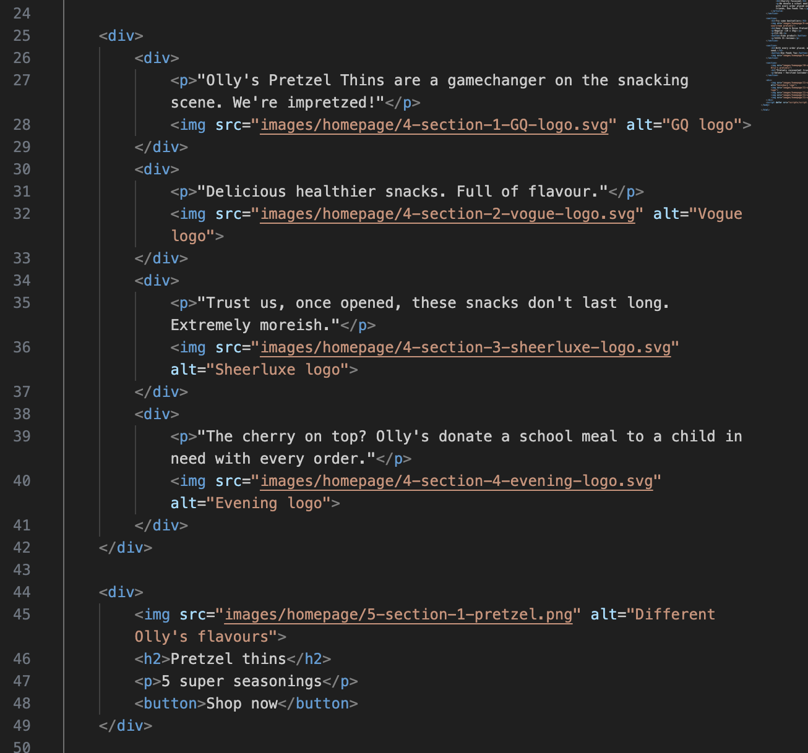

# Procesverslag
Markdown is een simpele manier om HTML te schrijven.  
Markdown cheat cheet: [Hulp bij het schrijven van Markdown](https://github.com/adam-p/markdown-here/wiki/Markdown-Cheatsheet).

Nb. De standaardstructuur en de spartaanse opmaak van de README.md zijn helemaal prima. Het gaat om de inhoud van je procesverslag. Besteedt de tijd voor pracht en praal aan je website.

Nb. Door *open* toe te voegen aan een *details* element kun je deze standaard open zetten. Fijn om dat steeds voor de relevante stuk(ken) te doen.

## Jij

  
uitwerken voor kick-off werkgroep

  ### Auteur:
  Tyneisha van Veltum

  #### Je startniveau:
  Mijn startniveau is blauw

  #### Je focus:
  Mijn focus is de surface plane
 

## Je website

  
uitwerken voor kick-off werkgroep

  ### Je opdracht:
  De website die ik wil gaan namaken is de volgende: Olly's - https://ollys-ollys.com
  
  Deze website is gemaakt voor het bedrijf Olly's. Olly's zit in de voedselbranche en verkoopt gezonde snacks, waaronder ook pakjes pretzels.

  #### Screenshot(s) van de eerste pagina (small screen): 
  De eerste pagina die ik zal namaken is de homepagina. 
  

  #### Screenshot(s) van de tweede pagina (small screen):
  De tweede pagina die ik zal namaken is de Our Story-pagina. 
  
 

## Toegankelijkheidstest 1/2 (week 1)

  
uitwerken na test in 2e werkgroep

  ### Bevindingen
  De test deed ik samen met Kim. Ik kwam achter de volgende dingen:
  - Het is ontzettend vermoeiend om telkens te moeten luisteren naar een voiceover
  - Er wordt veel gesproken, door de voiceover
  - De taal van de html staat op 'nl' terwijl mijn website in het engels is. Daardoor klinken de teksten vreemd en vaag als het wordt uitgesproken door een Nederlandse stem.
  - Kim vond de alternatieve teksten bij de afbeeldingen iets te lang.

## Breakdownschets (week 1)

  
uitwerken na afloop 3e werkgroep

  ### de hele pagina: 
  

  ### dynamisch deel (bijv menu): 
  

  ### wellicht nog een dynamisch deel (bijv filter): 
  

## Voortgang 1 (week 2)

  
uitwerken voor 1e voortgang

  ### Stand van zaken
  Tijdens de eerste 2 weken van Frontend moest ik heel erg wennen aan code schrijven. De eerste opdrachten gingen goed (over html en CSS) maar in de tweede week had ik meer moeite met het begrijpen en toepassen van Javascript.
  

  ### Agenda voor meeting
  samen met je groepje opstellen

  | student 1      | student 2          | student 3    | 
  | ---            | ---                | ---          |
  | Divjes bespreken| Michelle wilde     | Dante kwam   |
  | Article gebruik| weten of zij teveel| erachter dat |
  | Section gebruik| div'jes had gebruikt| een section | 
  | ...            |                    |met H2 moet   |

  ### Verslag van meeting
  hier na afloop snel de uitkomsten van de meeting vastleggen

  - Teveel divjes in het begin. Pas het aan naar sections en in de sections verschillende articles.
  - Vraag: Moet de 'p' review buiten de section staan? 'Ja, de review moet buiten de section staan, in de header.'
  - 'Vergeet niet om de header en footer aan te maken, en de nav verder te maken.'
  - Belangrijkste is om mijn html volledig af te ronden en daarna pas door te gaan met CSS.
  - Divjes zijn niet toegankelijk. Een persoon die de voiceover functie gebruikt kan namelijk een Section skippen maar een div wordt gezien als leeg vlak, dit kan dus niet worden geskipt.

## Voortgang 2 (week 3)

  
uitwerken voor 2e voortgang

  ### Stand van zaken
  hier dit ging goed & dit was lastig (neem ook screenshots op van delen van je website en code)

  ### Agenda voor meeting
  samen met je groepje opstellen

  | student 1      | student 2          | student 3    | student 4        |
  | ---            | ---                | ---          | ---              |
  | dit bespreken  | en dit             | en ik dit    | en dan ik dat    |
  | en dat ook nog | dit als er tijd is | nog een punt | dit wil ik zeker |
  | ...            | ...                | ...          | ...              |

  ### Verslag van meeting
  hier na afloop snel de uitkomsten van de meeting vastleggen

  - punt 1
  - punt 2
  - nog een punt
- ...

## Toegankelijkheidstest 2/2 (week 4)

  
uitwerken na test in 9e werkgroep

  ### Bevindingen
  Lijst met je bevindingen die in de test naar voren kwamen (geef ook aan wat er verbeterd is):

## Voortgang 3 (week 4)

  
uitwerken voor 3e voortgang

  ### Stand van zaken
  hier dit ging goed & dit was lastig (neem ook screenshots op van delen van je website en code)

  ### Agenda voor meeting
  samen met je groepje opstellen

  | student 1      | student 2          | student 3    | student 4        |
  | ---            | ---                | ---          | ---              |
  | dit bespreken  | en dit             | en ik dit    | en dan ik dat    |
  | en dat ook nog | dit als er tijd is | nog een punt | dit wil ik zeker |
  | ...            | ...                | ...          | ...              |

  ### Verslag van meeting
  hier na afloop snel de uitkomsten van de meeting vastleggen

  - punt 1
  - punt 2
  - nog een punt
  - ...

## Eindgesprek (week 5)

  
uitwerken voor eindgesprek

  ### Je uitkomst - karakteristiek screenshots:
  

  ### Dit ging goed/Heb ik geleerd: 
  Korte omschrijving met plaatjes

  

  ### Dit was lastig/Is niet gelukt:
  Korte omschrijving met plaatjes

  

## Bronnenlijst

  
continu bijhouden terwijl je werkt

  Nb. Wees specifiek ('css-tricks' als bron is bijv. niet specifiek genoeg). 
  Nb. ChatGpT en andere AI horen er ook bij.
  Nb. Vermeld de bronnen ook in je code.

  1. bron 1
  2. bron 2
  3. ...

