# Procesverslag
Markdown is een simpele manier om HTML te schrijven.  
Markdown cheat cheet: [Hulp bij het schrijven van Markdown](https://github.com/adam-p/markdown-here/wiki/Markdown-Cheatsheet).

Nb. De standaardstructuur en de spartaanse opmaak van de README.md zijn helemaal prima. Het gaat om de inhoud van je procesverslag. Besteedt de tijd voor pracht en praal aan je website.

Nb. Door *open* toe te voegen aan een *details* element kun je deze standaard open zetten. Fijn om dat steeds voor de relevante stuk(ken) te doen.

## Jij

  
uitwerken voor kick-off werkgroep

  ### Auteur:
  Tyneisha van Veltum

  #### Je startniveau:
  Blauw

  #### Je focus:
  Responsive
 

## Je website

  
uitwerken voor kick-off werkgroep

  ### Je opdracht:
  https://milkbarstore.com

  #### Screenshot(s) van de eerste pagina (small screen): 
  Milk Bar homepagina
  

  #### Screenshot(s) van de tweede pagina (small screen):
  Milk Bar product-pagina van Birthday Cake
  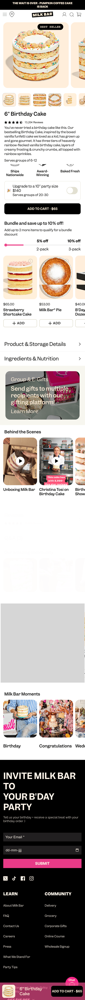
 

## Toegankelijkheidstest 1/2 (week 1)

  
uitwerken na test in 2e werkgroep

  ### Bevindingen
  #### Bevindingen eerste toegankelijkheidstoets (09/09/25)
  ##### Content 

  Milk Bar maakt gebruik van simpele taal, maar zij maken wel veel gebruik van trendy termen. Zo proberen zij internet afkortingen te gebruiken zoals 'fam', in plaats van 'family', maar ook zinnen zoals: "cozy weatcher calls for cozy treats." Ze maken dan ook veel gebruik van metaforen die wellicht lastig kunnen zijn voor mensen die zich niet bewust zijn van internet-taal. 

  De buttons en links op de homepagina hebben soms beperkte informatie. Zo hebben ze een aantal "learn-more"-buttons en "order-now"-buttons. Zo heb ik deze twee vereisten een nee gegeven voor de eerste toegankelijkheidstoets. 

  ##### Global code 
  De HTML code is niet gevalideerd. De rode errors zijn onder andere van:

  - ID's die worden gedupliceerd in de code
  - Img's die geen alt-tekst hebben
  - CSS die geschreven is in de HTML

  Ook is er een "polite"-message wanneer de voice over wordt geactiveerd op de website. De website geeft dan aan dat als er feedback is voor de website, dat dit kan worden verstuurd naar het bedrijf. 
  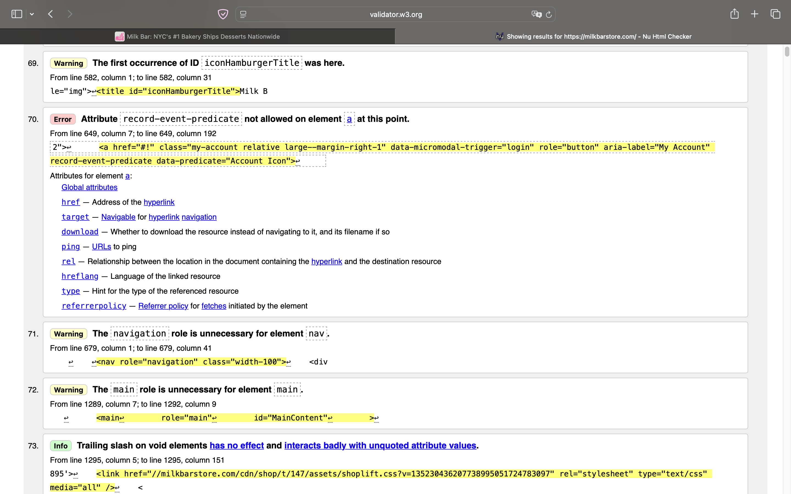
  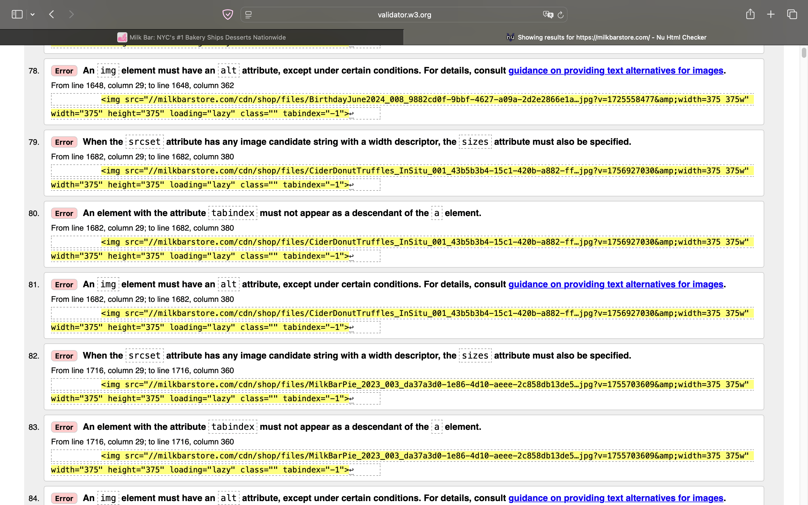
  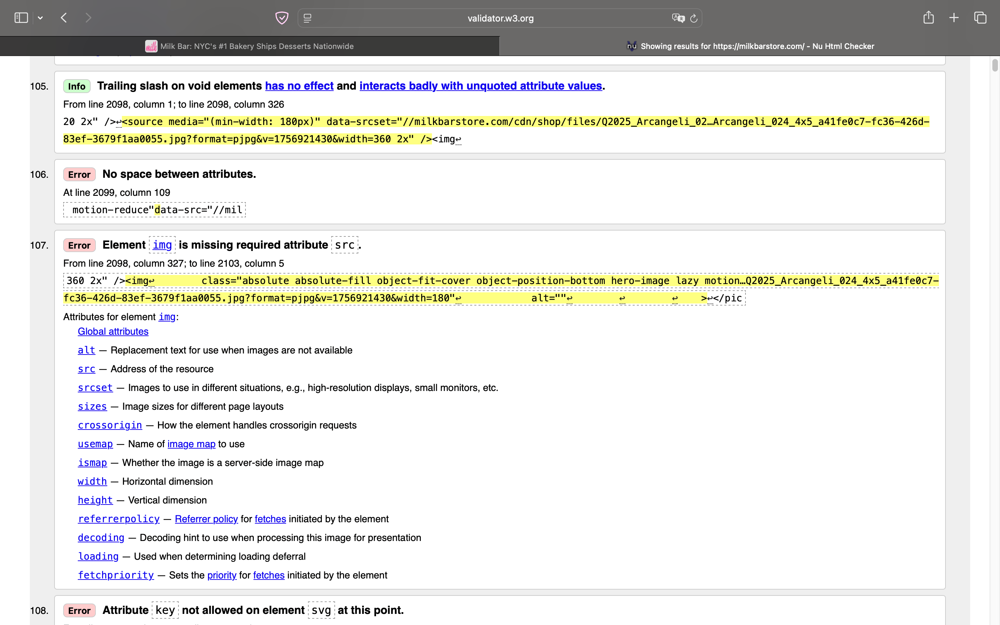

  Elke webpagina krijgt een unieke titel.
  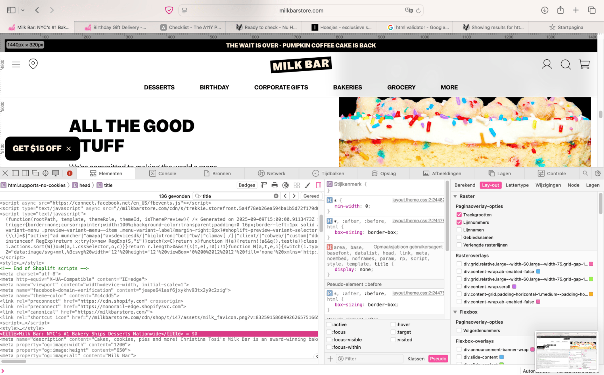

  Lang attribute wordt in de HTML geplaatst om de taal van de pagina aan te duiden. Verder is de viewport zoom niet uitgezet.
  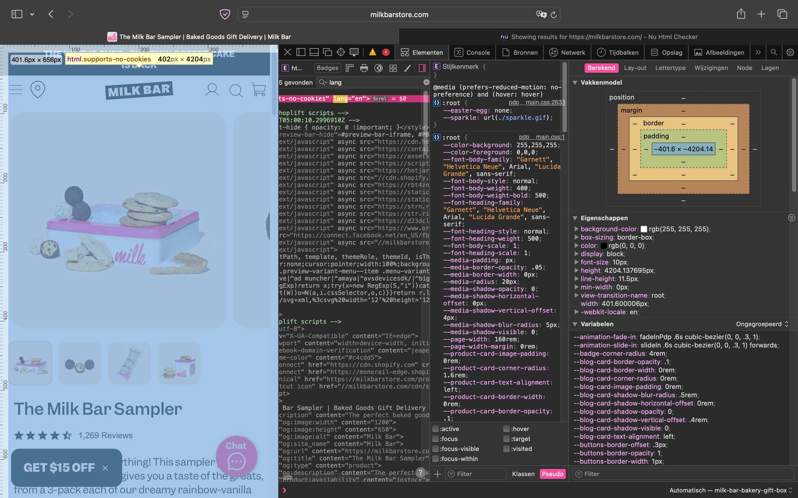

  ##### Keyboard
  Er is een duidelijke visuele focus stijl voor interactieve elementen en er kan makkelijk worden genavigeerd door middel van de toetsenbord input. 

  Echter missen er wel nog een aantal visuele elementen op de webpagina om volledig toegankelijk te zijn:

  - Zo zijn er wel pijltjes zichtbaar bij de desktopversie van de carousels, maar niet op de mobiele versie. Dan verdwijnen de pijltjes en kan er alleen nog worden gescrold van links naar rechts. 
  - Na een H2 wordt er ook weer een H1 gebruikt.

  ##### Mobile and touch

  - De website kan op elke manier worden geroteerd;
  - Horizontale scrolling is nog steeds aanwezig op de mobiele versie en de visuele pijltjes (die wel aanwezig waren bij de desktop versie) zijn verwijderd;
  - De buttons en links zijn groot genoeg om geactiveerd te worden;
  - Er is niet genoeg ruimte tussen interactieve items en een scroll-gebied:
    - Afbeeldingen zijn namelijk ook klikbaar. Dit kan zorgen voor frustratie bij handtrillingen.
  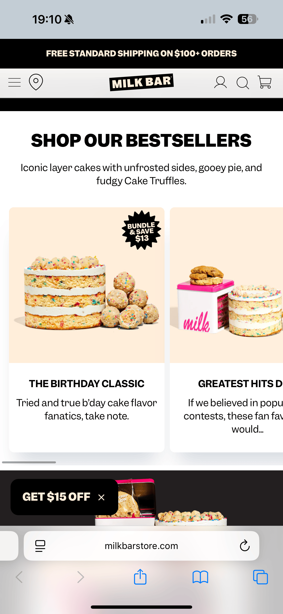

  ##### Headings
  Er wordt op de webpagina's gebruik gemaakt van heading elementen om nieuwe content te introduceren. De indeling is soms wel verschillend. Zo kan er als eerste een afbeelding worden geplaatst en daarna de heading. 

  - Er is op de homepagina gebruik gemaakt van meer dan 1 H1
  - Er worden dus ook meerdere heading levels gebruikt. De H2's en H3's worden op de juiste manier geïmplementeerd, maar er is wel meerdere keren gebruik gemaakt van de H1 op de homepagina. Dit zorgt ervoor dat de hiërarchie niet meer klopt.
  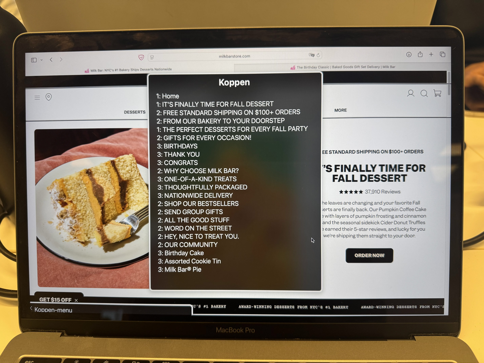

  ##### Lists
  Voor list content wordt er gebruik gemaakt van divs. Voor de verschillende carrousel secties wordt er geen gebruik gemaakt van een ul selector, maar een div.
  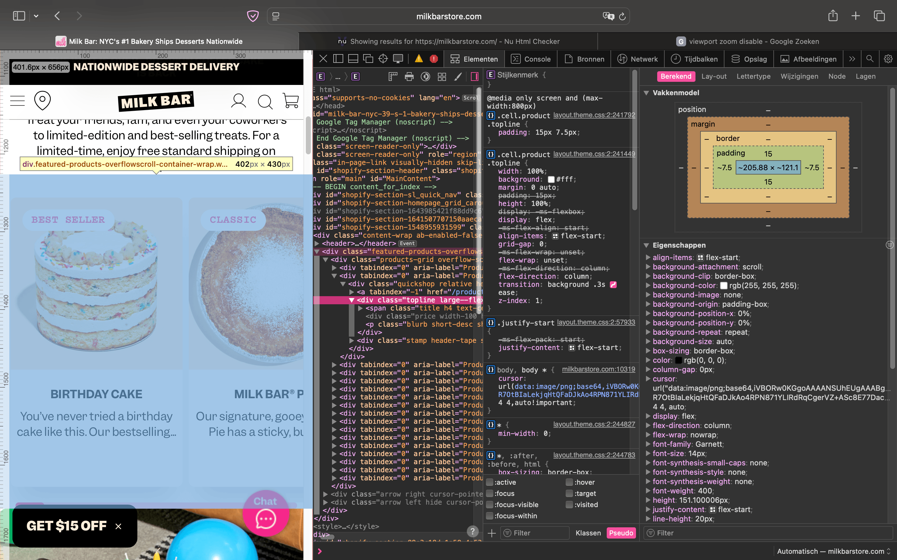  

  ##### Images
  - De HTML Validator had al aangegeven dat er voor een een grote hoeveelheid img's geen alt-tekst is gemaakt. Ik had wel een aria-label gezien bij de hero-grid. Hier werd aangegeven dat er werd doorgelinkt naar de Collection-webpagina van de website.
  - Er wordt op de website geen gebruik gemaakt van complexe afbeeldingen, zoals grafieken of kaarten.

  ##### Media (Video and Audio)
  Aan het einde van de homepagina worden drie elementen in een section getoond die de community (social media) weergeven van Milk Bar. Er is ook een TikTok die automatisch afspeelt. Er is geen audio. De video kan niet worden gepauzeerd. In de video kan er geen audio worden aangezet en is er wel ondertiteling in de video aanwezig. Dit zou niet kunnen worden afgelezen door een voice over.

  ##### Controls
  De betekenis van de selectors:

  - a = navigeren naar een andere pagina, sectie, bestand of extern adres.
  - button = een actie uitvoeren binnen de huidige pagina.
  - link = metadata en externe bronnen koppelen (meestal in `head`).

  - Een a wordt gebruikt voor het navigeren naar een andere pagina binnen de website.
  - Het is visueel duidelijk dat een element een link is: de woorden in de 'a' zijn kapitaal, dikgedrukt en het omvat zich in een kader in een andere kleur. Er is ook een hover aanwezig (dan wordt de 'a' roze). 
  - Er wordt gebruik gemaakt van de :focus states, dit is 13 keer terug te vinden in de CSS van Milk Bar.
  - Er wordt geen gebruik gemaakt van een "skip link".
  - Aan het eind van de pagina wordt er gebruik gemaakt van social media posts, bij het drukken van deze elementen wordt een nieuwe tab geopend naar het social media profiel.
  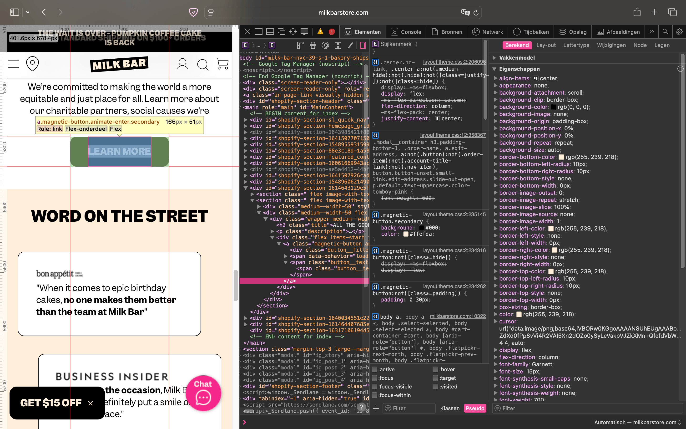

  ##### Appearance
  - Er is geen gebruik gemaakt een dark mode.
    - Bij het klassiek omkeren van de kleuren zijn de teksten en de afbeeldingen nog goed te lezen en scannen.
  - Bij het aanzetten van verschillende kleurfilters, zijn de teksten en afbeeldingen nog goed te lezen en scannen. Ik heb de volgende kleurfilters uitgeprobeerd:
    - Grijstinten
    - Protanopie (rood-groenfilter)
    - Deuteranopie (groen-roodfilter)
    - Tritanopie (blauw-geelfilter)
    - Kleurtint
  - Er is een hoog contrast, bij gebruik van de Chrome extensie Accessible Web, heeft de homepagina een score gekregen van 87 van de 100. De punten die werden getoond waren de volgende:    
  - Het is mogelijk om de website teksten te vergroten naar 200%.

  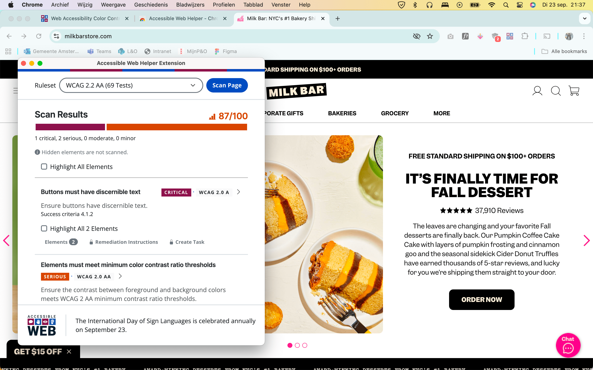
  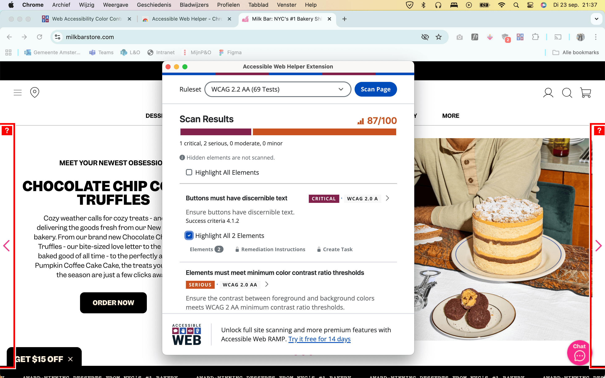
  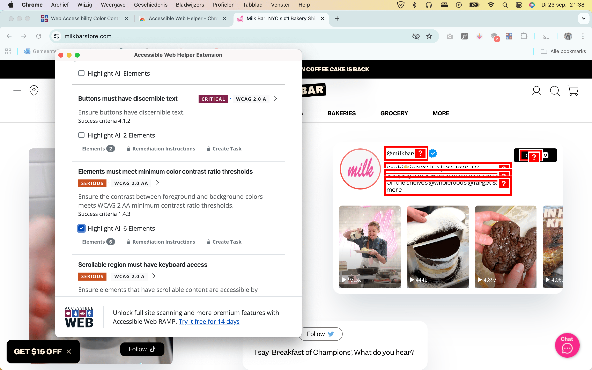
  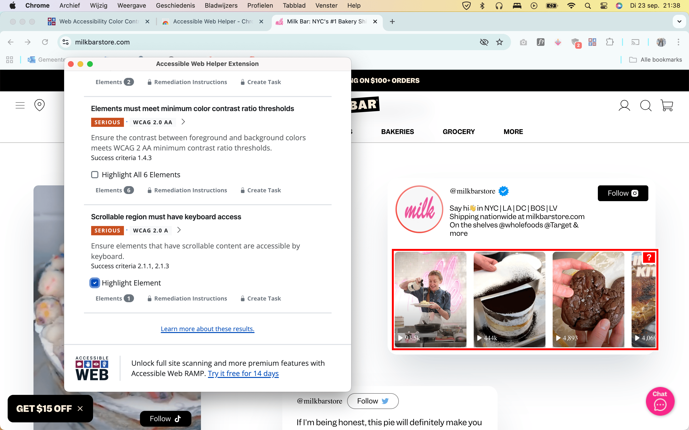
  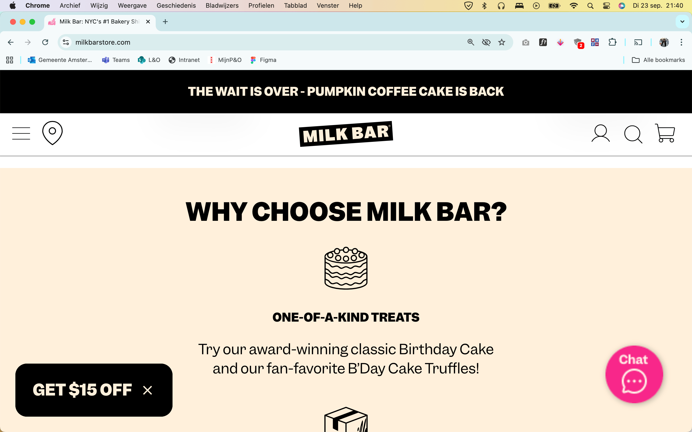

  ##### Animation
  - De animaties op de website zijn subtiel en niet te heftig.
  - Er is geen backgound video aanwezig op de website.

  ##### Color contrast
  - Contrast tussen normal-sized text is hoog;
  - Contract voor large-sized test is hoog;
  - Contrast voor iconen is hoog;
  - Contrast van teksten boven afbeeldingen is hoog;
  - Er wordt geen gebruik gemaakt van ::selection.

## Breakdownschets (week 1)

  
uitwerken na afloop 3e werkgroep

  ### de hele pagina: 
  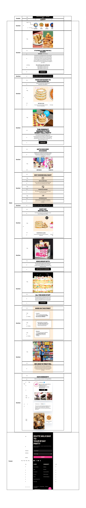

  ### dynamisch deel (bijv menu): 
  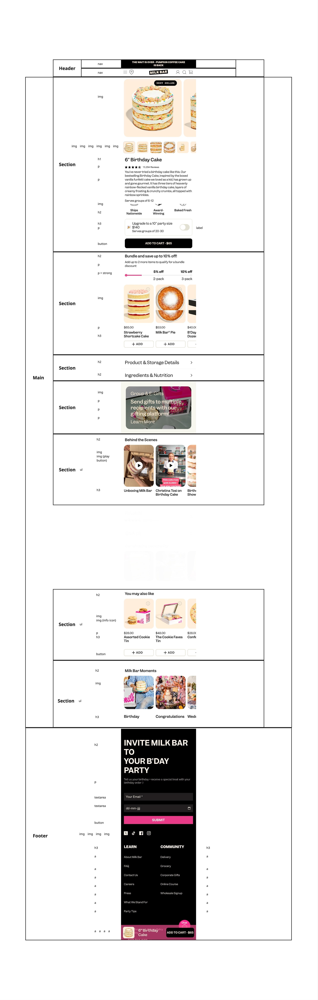

## Voortgang 1 (week 2)

  
uitwerken voor 1e voortgang

  ### Stand van zaken
  Ik heb de HTML van mijn homepagina geschreven maar ik heb moeite met het ontwikkelen van de carrousels, omdat ik niet weet of ik alle onderdelen (img's, p's en a's) kan toevoegen in de ul. Ook weet ik niet of ik gebruik maak van te veel sections, en dat ik wellicht andere HTML elementen moet gebruiken.

  ### Agenda voor meeting
  Tyneisha
  - Wat moet de volgorde zijn van mijn ul?
  - Wanneer moet ik aria-labels gebruiken?
  - Wat is de beste manier om mijn carrousels te ontwikkelen?

  Lam
  - X

  Roan
  - Wat zijn de correcte elements voor: tijd, prijs, etc.
  - Gebruik van elements, is nu juist?
  - Is de nesting in de footer correct?
  - Heb ik de SVG's juist uitgevoerdt
  - Code voor invis class.

  Sidney
  - HTML sections?
  - CSS carousel

  ### Verslag van meeting
  - In de head had ik een nav gebruikt voor een scroll animatie waar het laatste nieuws en aanbiedingen worden getoond. De studentassistente had laten weten dat dit niet nodig was. Ik hoefde dit niet in de nav te plaatsen en kon het als 'a' plaatsen in de code; 
  - De sections kunnen laten worden gestijld door de h2 onder de img's te plaatsen;
  - Probeer z.s.m. de img's te plaatsen in je document en de alt tekst erin toe te voegen;
  - Sections moeten een heading bevatten.

  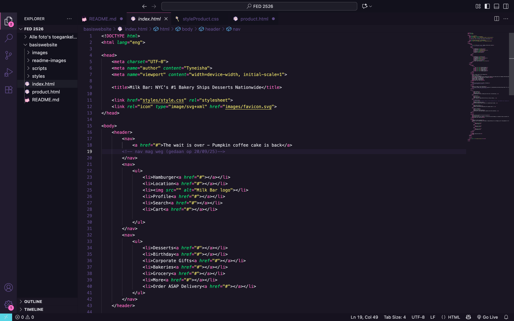
  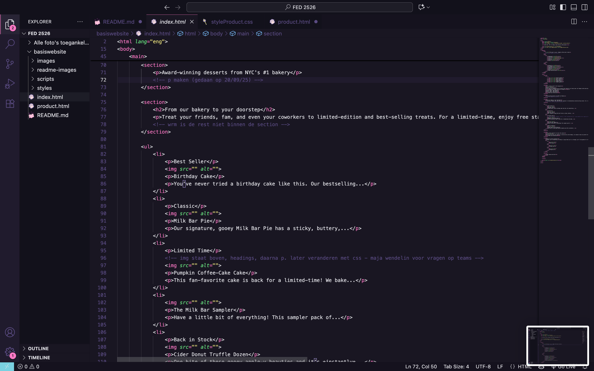

## Voortgang 2 (week 3)

  
uitwerken voor 2e voortgang

  ### Stand van zaken
  hier dit ging goed & dit was lastig (neem ook screenshots op van delen van je website en code)

  ### Agenda voor meeting
  Tyneisha
  - Hoe moet ik fonts in mijn CSS oproepen?
  - Hoe kan ik ervoor zorgen dat ik de SVG's uit de originele website op mijn website kan plaatsen?
  - Staan de sterren voor de reviews in de hero er goed in?

  Lam
  - X

  Roan
  - Mijn dunste font wordt niet goed opgeroepen en geeft een foutmelding aan

  Sidney
  - X

  ### Verslag van meeting
  hier na afloop snel de uitkomsten van de meeting vastleggen

  - Ik had geen .. gedaan bij het oproepen van mijn fonts, ook wist ik niet dat ik aanhalingstekens moest toevoegen om een font op te roepen.
  - Ik wist niet dat ik SVG codes uit de website kon halen. Dit is mij nu gelukt door te kijken in de code van mijn gekozen website en de SVG te kopiëren als HTML-element.
  - Ik kan de sterren niet toevoegen als HTML icoontjes, maar ik moet ze oproepen door middel van de SVG's die ook in de originele website staan. Deze SVG's kan ik dan plaatsen in mijn P.

## Toegankelijkheidstest 2/2 (week 4)

  
uitwerken na test in 9e werkgroep

  ### Bevindingen
  Lijst met je bevindingen die in de test naar voren kwamen (geef ook aan wat er verbeterd is):
  - Ik ben erachter gekomen dat ik mijn HTML nog even goed moet valideren
  - Ik ben erachter gekomen dat mijn taal niet goed stond: eng in plaats van en
  - Mijn focus states heb ik ontwikkeld nadat ik de toegankelijkheidstest had gedaan

## Voortgang 3 (week 4)

  
uitwerken voor 3e voortgang

  ### Stand van zaken
  Tijdens de les ging het super goed. Het was voor mij een van de eerste keren dat ik goed snapte wat ik deed. Na de uitleg die ik kreeg over Grid, begreep ik het beter en kon ik aan het eind van de dag mijn homepagina afronden.

  ### Agenda voor meeting
  Tyneisha
  - Hoe kan ik het logo in de nav centreren en de andere SVG's clusteren aan de zijkanten?
  - Hoe kan ik mijn nav ontwikkelen door middel van Javascript?
  - Kan ik de roze cursor uit de website toevoegen door middel van CSS of moet dit ook via Javascript?
  - Hoe voeg ik een SVG toe aan mijn input field?
  - Hoe krijg ik een sluisteken tussen mijn flexbox children in de footer nav?

  Lam
  - Bij de producten in mijn grid, zijn ze niet op 1 lijn, hoe kan ik dit oplossen?

  Roan
  - Hoe krijg ik de img kleiner want het is te groot in vergelijking met de andere img's in de carrousel?

  Sidney
  - Hoe maak ik een regenboog hover voor mijn button?

  ### Verslag van meeting
  Na afloop de uitkomsten van de meeting vastleggen

  - Maak je nav in grid, op die manier blijft het toegankelijk zonder dat je extra nav's gaat ontwikkelen om het 'mooi' te krijgen;
  - Je cursor moet je aanpassen via Javascript, dit kan niet via CSS;
  - Ga aan de slag met de tweede pagina;
  - Bekijk het lesmateriaal van een paar weken geleden om te kijken hoe je een hamburger menu kan ontwikkelen;
  - @ media only screen and min-width 800px gebruiken voor responsivess;
  - Favicon nog toevoegen.

## Eindgesprek (week 5)

  
uitwerken voor eindgesprek

  ### Je uitkomst - karakteristiek screenshots:
  

  ### Dit ging goed/Heb ik geleerd: 
  - Ik merkte dat het mij beter af ging dan gedacht. Zo vond ik het super handig om mijn kleuren op te slaan in mijn root en deze op te roepen in mijn code, in plaats van losse HEX-codes te zoeken over mijn hele code-bestand.
  - Ik heb geleerd hoe ik een responsive webpagina kan ontwikkelen! Ik had geen idee hoe dit moest en zag dit voor het eerst bij een medestudent tijdens de feedbacksessies met de studentassistente. Dit is hoe ik leerde om mijn webpagina's responsive te maken. Toen vond ik het een stuk minder eng om zelf te proberen.
  - Ik heb vooral veel geleerd over grid. Ik had niet verwacht dat ik dit zo een handige tool zou vinden om mijn secties te stijlen. Dit heeft mij enorm geholpen bij het ontwikkelen van mijn webpagina's en ik kreeg het na een paar keer oefenen steeds meer onder de knie. Mijn voorkeur gaat nu ook meer naar grid dan naar flexbox.

  

  ### Dit was lastig/Is niet gelukt:
  - Ik vond het lastig om de slideshow te maken in mijn tweede pagina (de productpagina), ik wist niet hoe ik de nav (de kleine afbeeldingen) kleiner kon maken zodat het dezelfde hoogte zou hebben als de uitgelichte foto. 
  - Ik vond het lastig om mijn tweede pagina responsive te maken, maar dit was mij uiteindelijk gelukt door de hele main in een grid te plaatsen.
  - Ik heb moeite gehad bij het ontwikkelen van mijn hamburgermenu. Het is mij niet gelukt om de homepagina te dimmen wanneer het hamburgermenu te zien is. 
  - Als ik meer tijd had, had ik de mobiele nav in de main, een nav gemaakt in plaats van een section. Ik probeerde dit aan te passen in mijn code, maar het was niet meer mogelijk om dit op tijd af te ronden.
  - Ik krijg mijn slideshow niet uit mijn footer, dat vond ik ook wel heel jammer. Dat ik daar uiteindelijk niet genoeg tijd meer voor had om dat op te lossen.
  - Tenslotte vind ik het jammer dat het mij niet is gelukt om de arrows toe te voegen aan mijn carrousels, dit zorgt er jammer genoeg voor dat het alleen scrollbaar is door middel van horizontaal scrollen.

  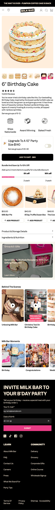

## Bronnenlijst

  
continu bijhouden terwijl je werkt

  Nb. Wees specifiek ('css-tricks' als bron is bijv. niet specifiek genoeg). 
  Nb. ChatGpT en andere AI horen er ook bij.
  Nb. Vermeld de bronnen ook in je code.

  Homepagina
  1. Responsiveness breakpoints uitleg - https://www.browserstack.com/guide/responsive-design-breakpoints 
  2. Marquee instellingen voor mijn spinnende p in mijn homepagina - https://htmleditor.w3schools.in/?filename=html_css_scrolling_text_using_css en https://codepen.io/ohheckitsbeck/pen/ExYRadq?editors=1100
  3. Box-shadow voor mijn carrousel van producten - https://milkbarstore.com
  4. Het verbergen van content op de webpagina maar het wel benoemen in de screenreader - https://www.a11yproject.com/posts/how-to-hide-content/ 
  5. Afbeelding veranderen in hover in CSS - https://www.geeksforgeeks.org/css/how-to-change-image-on-hover-with-css/
  6. Custom scrollbar ontwikkelen - https://www.youtube.com/watch?v=lvKK2fs6h4I
  7. Leren omgaan met Flexbox - https://www.w3schools.com/css/css3_flexbox_responsive.asp en https://css-tricks.com/snippets/css/a-guide-to-flexbox/
  8. Border instellingen - https://www.w3schools.com/cssref/pr_border-width.php en https://www.w3schools.com/css/css_border_color.asp

  Productpagina
  1. Het verbergen van content op de webpagina maar het wel benoemen in de screenreader - https://www.a11yproject.com/posts/how-to-hide-content/ 
  2. Toggle Switch - https://www.w3schools.com/howto/howto_css_switch.asp 
  3. Een linear gradient maken voor mijn kortingscode bar - https://www.w3schools.com/css/css3_gradients.asp
  4. Margin op -1 zetten zodat ik geen spacing meer heb aan de rechterkant - https://stackoverflow.com/questions/11495200/how-do-negative-margins-in-css-work-and-why-is-margin-top-5-margin-bottom5 
  5. Micro-interactie - https://www.w3schools.com/jsref/event_onclick.asp
  6. Micro-interactie - https://www.freecodecamp.org/news/javascript-settimeout-how-to-set-a-timer-in-javascript-or-sleep-for-n-seconds/
  7. Micro-interactie - https://www.w3schools.com/jsref/met_win_settimeout.asp

  General
  1. Mijn navigatie sticky maken op de webpagina - https://www.w3schools.com/howto/howto_js_navbar_sticky.asp
  2. Het verbergen van content op de webpagina maar het wel benoemen in de screenreader - https://www.a11yproject.com/posts/how-to-hide-content/ 
  3. Hamburgermenu ontwikkelen met HTML, CSS en Javascript - https://codepen.io/shooft/pen/myepoJo?editors=1100
  4. Gebruik maken van de verschillende states - https://zellwk.com/blog/style-hover-focus-active-states/

